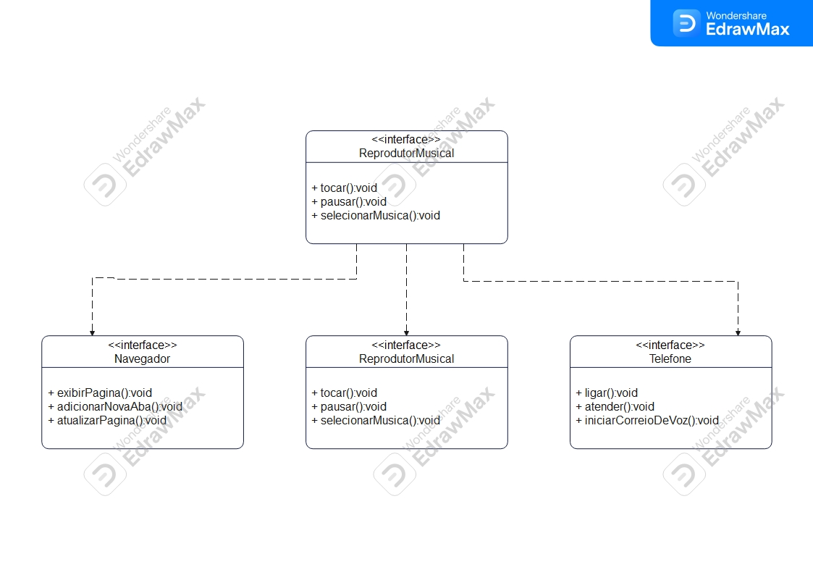

# Desafio de Modelagem UML: diagramação de Classes do iPhone

Este projeto é um desafio prático proposto no Santander Bootcamp 2023 - Fullstack Java+Angular
para aplicar conceitos de:

- análise de requisitos
- programação orientada a objetos e modelagem UML.
- O objetivo é criar um modelo UML representando as - classes e interfaces que desempenham funções de Reprodutor Musical, Telefone e Navegador na Internet em um iPhone.

## Stay Connected

- Linkedin: [Flávio Adriano](https://www.linkedin.com/in/flavioadriano/)
- GitHub Repository: [FravonDev](https://github.com/FravonDev)
- Visit [My portfolio website](https://fravondev.vercel.app)
